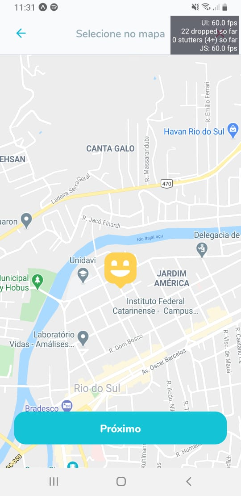
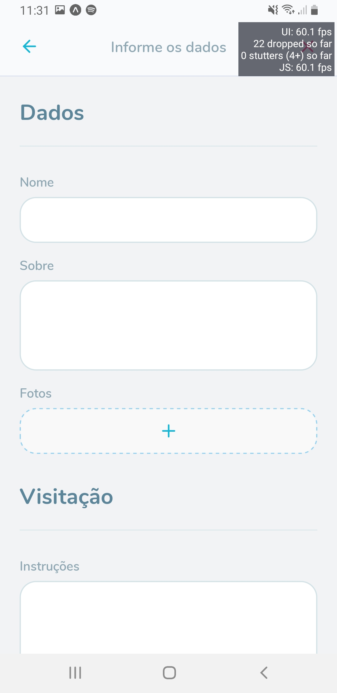

<h1 align="center">
    
</h1>

  <a href="#rocket-tecnologias">Tecnologias</a>&nbsp;&nbsp;&nbsp;|&nbsp;&nbsp;&nbsp;
  <a href="#-projeto">Projeto</a>&nbsp;&nbsp;&nbsp;|&nbsp;&nbsp;&nbsp;
  <a href="#-como-rodar">Como rodar</a>&nbsp;&nbsp;&nbsp;|&nbsp;&nbsp;&nbsp;
  <a href="#-como-contribuir">Como contribuir</a>&nbsp;&nbsp;&nbsp;
  

 

 

  

  

## Curso Rocketseat - NLW3

## 🚀 Tecnologias

Esse projeto foi desenvolvido com as seguintes tecnologias:

- [React](https://pt-br.reactjs.org/) - v16.13.1
- [Node.js](https://nodejs.org/en/) - v14.4.0
- [Yarn](https://yarnpkg.com/) - 1.22.4
- [Npm](https://www.npmjs.com/) - 6.14.5
- [SQLite](https://www.sqlite.org/index.html)

## 💻 Projeto

O Happy é uma plataforma para agendar visitas a orfanatos.

Consome a [API](https://github.com/jamangueira7/nlw3-backend).

## 🚀 Como Rodar

- Clone o projeto.
- Rode yarn install (pode usar npm install de acordo com a sua configuração).
- Na pasta src/services aquivo api.ts colocar seu IP em baseURL para funcionar.
- Rode seu ambiente (eu usei o expo): yarn start

###### Usar o expo: Baixe no seu celular o app "expo", depois rode o comando "expo start". Coloque sua camera para ler o QRCode gerado e pronto.
 

## 🤔 Como contribuir

- Faça um fork desse repositório;
- Cria uma branch com a sua feature: `git checkout -b minha-feature`;
- Faça commit das suas alterações: `git commit -m 'feat: Minha nova feature'`;
- Faça push para a sua branch: `git push origin minha-feature`.

Depois que o merge da sua pull request for feito, você pode deletar a sua branch.

